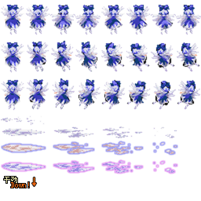

* content
{:toc}

### 需求
有了第一集和第二集的两个函数，我们很容易可以写出将图像按行列平均切割的函数。  
如图是游戏妖精大战争中琪露诺的素材，

  

可以看到游戏中的动画都是一张张静态素材组成的，为了方便加载和分类，一些相关的素材直接按一定间隔排列在了一张图中，在第二集中我们已经得到了从图片中加载部分图片的方法，现在通过这个例子，可以使得我们的函数更易用。

```cpp
std::vector<pImage> GetImageGroup(pImage img,int row,int col) //行列切割
{
	std::vector<pImage> vec;
	const int Height=img->GetHeight()/row;
	const int Width=img->GetWidth()/col;
	for (int i=0;i<row;i++)
	{
		for (int j=0;j<col;j++)
		{
			vec.push_back(CutImage(img,Width*j,Height*i,Width,Height));
		}
	}
	//delete img;  //这里不能delete img资源是需要复用的
	return vec;
}
```

有了这个函数我们可以方便的将图片按照行列分割，结果返回一个vector